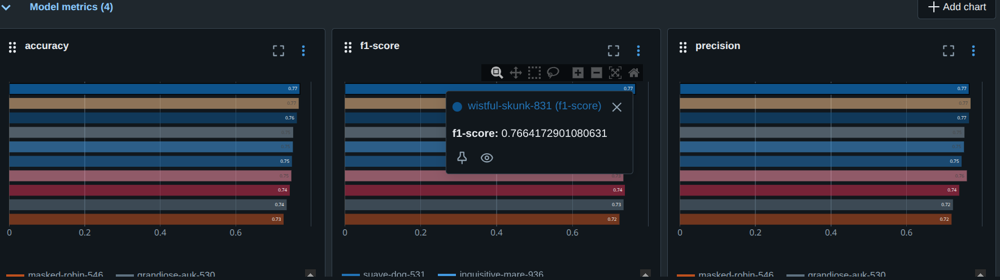

# Bank Customer Churn Prediction

This repository contains a module for trying some models to get experience with mlflow. Models are to predict bank consumer churn. It demonstrates how to integrate MLflow for experiment tracking, model logging (with input/output schema signatures), and artifact management.

## Overview

- The code preprocesses customer data, trains a LightGBM model, and tracks the entire machine learning lifecycle using MLflow. This includes:

- Setting up MLflow experiment and run tracking

- Logging model parameters, metrics, and artifacts (e.g., confusion matrix plot)

- Inferring and logging the model signature (input/output schema) for consistent model deployment and validation

- Registering the trained model in the MLflow Model Registry

## What's Done?

- Preprocessing: Cleans and prepares the dataset for training.

- Model Training and Logging: We can use any model and play with hyperparameters.

MLflow Integration:

- Logs parameters and evaluation metrics (accuracy, precision, recall, F1-score).

- Logs model with schema inferred automatically using infer_signature.

- Logs dataset and confusion matrix plot as artifacts.

- Registers the trained model in MLflow registry.

- Tags the run with the model type.

## Selected Model

- For our case the model selected was a LightGBM classifier as it has the maximum overall scores in F1 and accuracy scores.
- Key Parameters: n_estimators: 150, Max_depth: 5, learning_rate: 0.01 

- 

## Model Registering

- The best model was registered for production while the lease cashe size model was registerd for staging, If the production model has issues due to cashe size, the staging model will be served for production. This is a simulation only, not a real approach for our case.

- 
